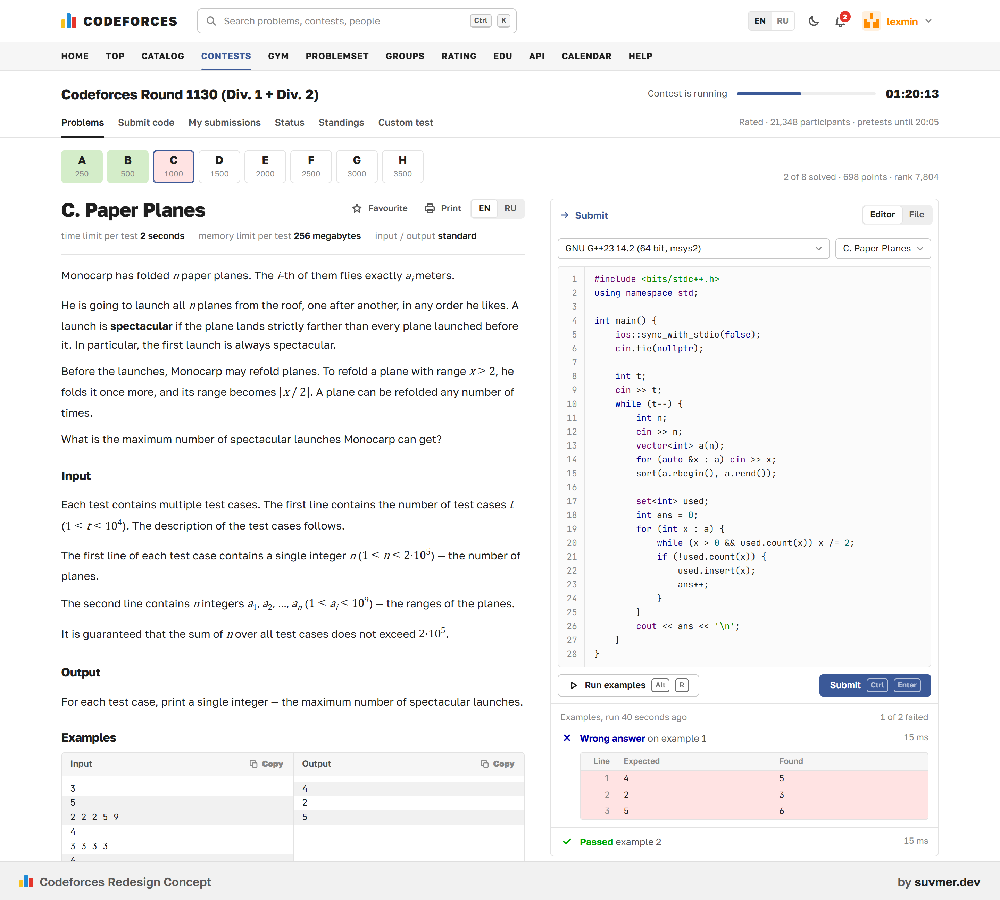

# Codeforces Redesign Concept

> ⭐ **If you like it, give it a star — I worked hard on this!** Pull requests are welcome too.

An unofficial, fan-made redesign of Codeforces: the same contests, the same rank colors and the same dense tables, with a modern interface. It is a static, clickable prototype with no build step and no backend.

Concept by [suvmer.dev](https://suvmer.dev).

**Promo, 30 seconds:** [promo/codeforces-redesign-concept.mp4](promo/codeforces-redesign-concept.mp4)

## Try it

Open `index.html` in a browser, or open the GitHub Pages site of this repository. The moon icon in the header switches the theme; `?theme=dark` forces dark mode.

On the problem page the editor is live: change `x > 0` to `x > 1` on line 20, press **Run examples**, then **Submit**.

## What stays

- Rank colors, including the black first letter of Legendary Grandmasters
- Verdict colors: green for accepted, blue for rejected, "Pretests passed" during a round
- The `→` box captions in `#3B5998`, the uppercase main menu, the three logo bars
- Green and pink rows in the problemset, colored bands on the rating graph
- The blog-first home page and the density of the tables

## What is new

| Screen | Changes |
|---|---|
| Problem | Editor next to the statement; **Run examples** shows expected vs found line by line; live pretest progress after submit; problem tiles with your status |
| Standings | Pinned own row, sticky header and handle column, accepted / tried per problem, predicted rating change |
| Home | Running round and its timer in the header and the sidebar, editorial hints behind spoilers |
| Search | `Ctrl+K` across problems (by name or ID), tags, people, blog posts and contests |
| Problemset | Difficulty filter as a strip of rating-band colors, coverage of the selected range, attempted-but-unsolved list |
| Profile | Interactive rating graph, progress to the next rank, activity heatmap with streaks, solved by difficulty |
| Contests | Your rank and rating change next to past contests, a month calendar colored by contest type |
| Everywhere | Dark mode with rank colors adjusted for a dark background, mobile layout |

## Screens

[Home](screenshots/04-home.png) ·
[Problem](screenshots/01-problem.png) ·
[Run → fix → submit](screenshots/02-run-fix-submit.png) ·
[Standings](screenshots/03-standings.png) ·
[Search](screenshots/05-search.png) ·
[Problemset](screenshots/06-problemset.png) ·
[Profile](screenshots/07-profile.png) ·
[Contests](screenshots/08-contests.png) ·
[Dark mode](screenshots/09-problem-dark.png) ·
[Mobile](screenshots/11-mobile.png)

Full-length pages are in [screenshots/full](screenshots/full).

## Notes

- Not affiliated with Codeforces. The Codeforces name and logo belong to their owners.
- All handles, ratings, contests and the problem "Paper Planes" are made up. The sample solution in the editor has a deliberate bug, and the demo judge understands only that solution.
- Plain HTML, CSS and JavaScript. Fonts: Golos Text and JetBrains Mono, both under the SIL Open Font License (see `assets/fonts`).
